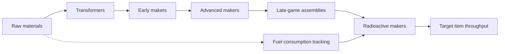

# AssemblyLine2PC.jl

[](https://LauraBMo.github.io/AssemblyLine2PC.jl/stable/) [](https://LauraBMo.github.io/AssemblyLine2PC.jl/dev/) [](https://github.com/LauraBMo/AssemblyLine2PC.jl/actions/workflows/CI.yml?query=branch%3Amain) [](https://codecov.io/gh/LauraBMo/AssemblyLine2PC.jl)

> Tools for exploring the resource graph of **Assembly Line 2** (PC) and planning hyper-efficient factories.

AssemblyLine2PC.jl ships the crafting tree for Assembly Line 2 together with utilities to quantify production requirements, highlight bottlenecks, and render readable reports directly from Julia. Instead of transcribing blueprints by hand, you can load the complete data graph, ask for the raw-material footprint of any item, and iterate on layouts before booting the game.

## Why visualize the factory graph?

### The challenge of late-game planning
High-tier Assembly Line 2 machines intertwine dozens of subassemblies and radioactive refineries. Tracking how many miners, cutters, and makers are required to sustain a target output quickly becomes error prone. Missing a single intermediate recipe can cascade into hours of manual rework.

### How this package helps
AssemblyLine2PC.jl builds a directed recipe graph from the game's data and offers:

- **Material accounting** – traverse the graph and compute raw-resource demand for any item or production rate.
- **Throughput insights** – estimate miner counts and top production speeds with helpers such as `nminers` and `topspeed`.
- **Readable breakdowns** – format recipe tables with PrettyTables, highlight transformers, and surface fuel consumption for radioactive makers.
- **Graph tooling** – leverage `Graphs.jl`/`MetaGraphsNext.jl` utilities for custom analyses or alternative visualizations.

## Quick start

### 1. Install the package
```julia
julia> import Pkg
julia> Pkg.add("https://github.com/LauraBMo/AssemblyLine2PC.jl.git")
```

### 2. Inspect a recipe
```julia
julia> using AssemblyLine2PC

julia> tree = datatree();  # build the complete crafting graph

julia> AssemblyLine2PC.cost(tree, "ElectricEngine")  # total raw-material units

julia> AssemblyLine2PC.cost(tree, "ElectricEngine")  # total raw-material units
```

### 3. Plan production throughput
```julia
julia> using AssemblyLine2PC: topspeed, nminers, viewgraph

julia> VG = viewgraph(tree);

julia> airb = "AIRBomber"

julia> top_miners = 310 + 46*2  # Your starters limit for the job. 

julia> VG(airb; miners = top_miners)
# PrettyTables report showing intermediate makers, pack ratios, and raw demand…

julia> VG(airb, 4, 6; miners = miners_needed)
```
## Factory graph overview


The graph encodes every recipe as a vertex with weighted edges showing ingredient ratios. Transformers (wire, liquid, gear, plate) feed makers, which in turn build late-game robotics and nuclear technology. Fuel requirements are annotated separately so radioactive chains can be planned alongside raw ore demand.

## Project resources
- 📘 [Stable Documentation](https://LauraBMo.github.io/AssemblyLine2PC.jl/stable/)
- 🧪 [Development Documentation](https://LauraBMo.github.io/AssemblyLine2PC.jl/dev/)
- 🧾 [CITATION.bib](./CITATION.bib) — cite this project in academic work.
- 📄 [License](./LICENSE)

## Governance and community

### Contributing
We welcome issues, discussions, and pull requests. To contribute:

1. Fork the repository and create feature branches from `main`.
2. Run the automated test suite (`julia --project -e 'using Pkg; Pkg.test()'`) before opening a pull request.
3. Document in-game assumptions (item rates, optional upgrades, etc.) so reviewers can reproduce your scenario.

### Code of conduct
This project follows the [Julia Community Standards](https://julialang.org/community/standards/). By participating, you agree to uphold a welcoming, inclusive environment.

### Release cadence
 ::TODO::

### Stay in touch
- File bugs, feature ideas, or data corrections in the [issue tracker](https://github.com/LauraBMo/AssemblyLine2PC.jl/issues).

Happy factory building!
