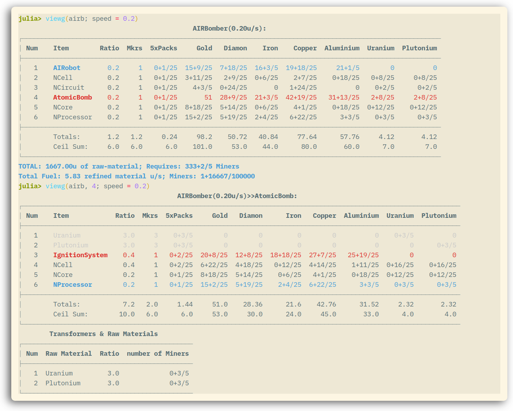

# AssemblyLine2PC.jl

[](https://LauraBMo.github.io/AssemblyLine2PC.jl/stable/) [](https://LauraBMo.github.io/AssemblyLine2PC.jl/dev/) [](https://github.com/LauraBMo/AssemblyLine2PC.jl/actions/workflows/CI.yml?query=branch%3Amain) 
> Tools for exploring the resource graph of **Assembly Line 2** (PC) and planning efficient factories.

You may consider this package as a Excel sheet with all the relevant information about the building-tree of the game, everything scaled to your current limit of starters and much easier to visualize and to navigate. See 

## Why visualize the factory graph?

### The challenge of late-game planning
High-tier Assembly Line 2 machines intertwine dozens of subassemblies and radioactive refineries. Tracking how many miners, cutters, and makers are required to sustain a target output quickly becomes error prone. Missing a single intermediate recipe can cascade into hours of manual rework.

### How this package helps
AssemblyLine2PC.jl builds a directed recipe graph from the game's data and offers:

- **Material accounting** – traverse the graph and compute raw-resource demand for any item or production rate.
- **Throughput insights** – estimate miner counts and top production speeds with helpers such as `nminers` and `topspeed`.
- **Readable breakdowns** – format recipe tables with PrettyTables, highlight transformers, and surface fuel consumption for radioactive makers.
- **Graph tooling** – leverage `Graphs.jl`/`MetaGraphsNext.jl` utilities for custom analyses or alternative visualizations.

## Quick start

### 1. Install the package
```julia
julia> import Pkg
julia> Pkg.develop("https://github.com/LauraBMo/MinerNumbers.jl.git") # Dependency
julia> Pkg.develop("https://github.com/LauraBMo/AssemblyLine2PC.jl.git")
```

### 2. Inspect a recipe
```julia
julia> using AssemblyLine2PC

julia> tree = datatree();  # build the complete crafting graph

julia> AssemblyLine2PC.cost(tree, "ElectricEngine")  # total raw-material units
```

### 3. Plan production throughput

Naviagate recipe for AI Robot Bomber ("AIRBomber" in [`Data.jl`](https://github.com/LauraBMo/AssemblyLine2PC.jl/blob/main/src/Data.jl)) at max theoretical speed for your given limit of starters:

```julia
julia> using AssemblyLine2PC

julia> VG = viewgraph();

julia> airb = "AIRBomber"
julia> max_miners = 310 + 46*2  # Your starters limit for the job. 

# PrettyTables report showing intermediate makers, pack ratios, and raw demand…
julia> VG(airb; miners = max_miners)
julia> VG(airb, 4, 6; miners = max_miners)
```

Here some screenshots showing the output.




## Factory graph overview


The graph encodes every recipe as a vertex with weighted edges showing ingredient ratios. Transformers (wire, liquid, gear, plate) feed makers, which in turn build late-game robotics and nuclear technology. Fuel requirements are annotated separately so radioactive chains can be planned alongside raw ore demand.

## Project resources
- 📘 [Stable Documentation](https://LauraBMo.github.io/AssemblyLine2PC.jl/stable/)
- 🧪 [Development Documentation](https://LauraBMo.github.io/AssemblyLine2PC.jl/dev/)
- 🧾 [CITATION.bib](./CITATION.bib) — cite this project in academic work.
- 📄 [License](./LICENSE)

## Governance and community

### Contributing
We welcome issues, discussions, and pull requests. To contribute:

1. Fork the repository and create feature branches from `main`.
2. Run the automated test suite (`julia --project -e 'using Pkg; Pkg.test()'`) before opening a pull request.
3. Document in-game assumptions (item rates, optional upgrades, etc.) so reviewers can reproduce your scenario.

### Code of conduct
This project follows the [Julia Community Standards](https://julialang.org/community/standards/). By participating, you agree to uphold a welcoming, inclusive environment.

### Release cadence
 ::TODO::

### Stay in touch
- File bugs, feature ideas, or data corrections in the [issue tracker](https://github.com/LauraBMo/AssemblyLine2PC.jl/issues).

Happy factory building!
