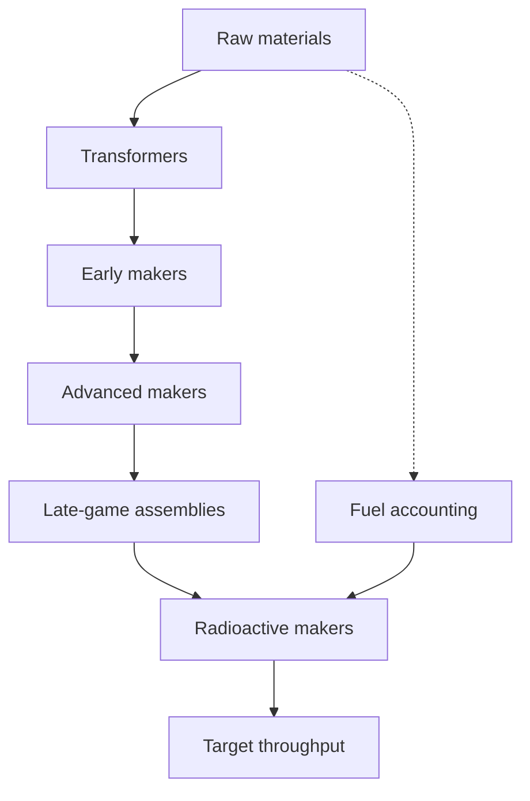

# Architecture overview

```@contents
Pages = ["architecture.md"]
Depth = 3
```

## Data ingestion pipeline

AssemblyLine2PC constructs a layered [`MetaGraph`](https://juliagraphs.org/MetaGraphsNext.jl/stable/)
where each recipe is a vertex and weighted edges encode ingredient ratios. The
`datatree` builder stitches together transformer, maker, and radioactive recipes
from the raw datasets defined in [`Data.jl`](https://github.com/LauraBMo/AssemblyLine2PC.jl/blob/main/src/Data.jl).

1. **Skeleton graph** – [`build_skeletontree`](@ref) loads the recipe list and
   creates vertices for every item with zeroed resource tuples.
2. **Topological traversal** – [`datatree`](@ref) iterates vertices in
   topological order so downstream costs are always available when needed.
3. **Cost accumulation** – [`vertex_costs`](@ref) recursively tallies raw
   resource demand, storing the result directly on the vertex for constant-time
   lookups.

!!! tip
    The tuple stored on each vertex aligns with [`tracked_materials`](@ref).
    Keep this ordering in mind when performing manual indexing, or prefer helper
    functions such as [`cost`](@ref) and [`total_material`](@ref) to avoid
    off-by-one mistakes.

## Extending the recipe set

Recipes are grouped by production tier in `RECIPES`. Adding new content usually
requires updating the dataset definitions and optionally attaching annotations to
new vertex types. A typical extension looks like:

```julia
using AssemblyLine2PC

recipes = AssemblyLine2PC.mk3  # start from an existing tier
push!(recipes, "FusionCell" => [("SuperAlloy", 2), ("CryoFuel", 1)])

tree = datatree()
vertex_data = tree["FusionCell"]
```

Because the graph is recomputed from scratch, modifications remain deterministic
and cache-friendly for documentation builds and tests.

## Distributed analyses

All functions operate on pure data structures without global state. This makes it
safe to broadcast workloads across processes:

```julia
using Distributed
addprocs(4)

@everywhere using AssemblyLine2PC
items = ["AtomicBomb", "NProcessor", "ElectricEngine"]

results = @distributed (vcat) for item in items
    tree = datatree()
    total_material(item, 1, tree)
end
```

Each worker builds its own `MetaGraph` and performs local analysis. Refer to the
[multi-node coordination tutorial](@ref tutorial-multinode) for a larger example
with structured result aggregation.

## Diagram



The directed edges represent how intermediate items feed higher-tier recipes.
`Fuel` is modeled as an auxiliary dependency so the same traversal can track both
ore extraction and energy demand.
