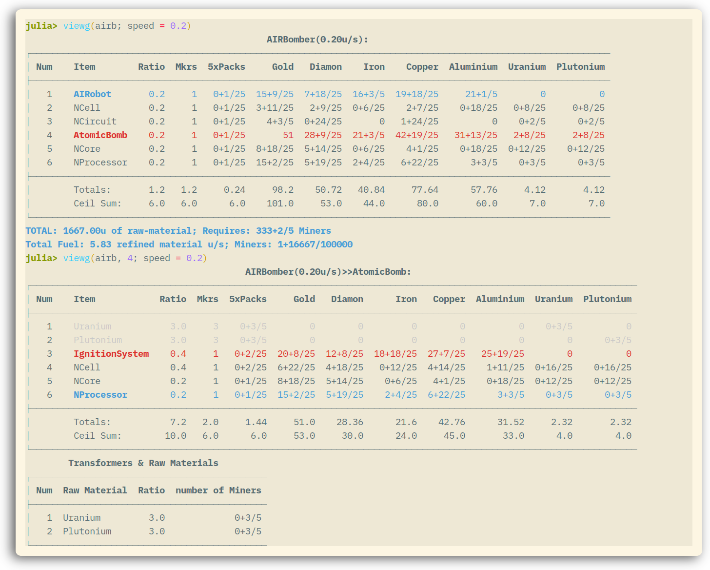
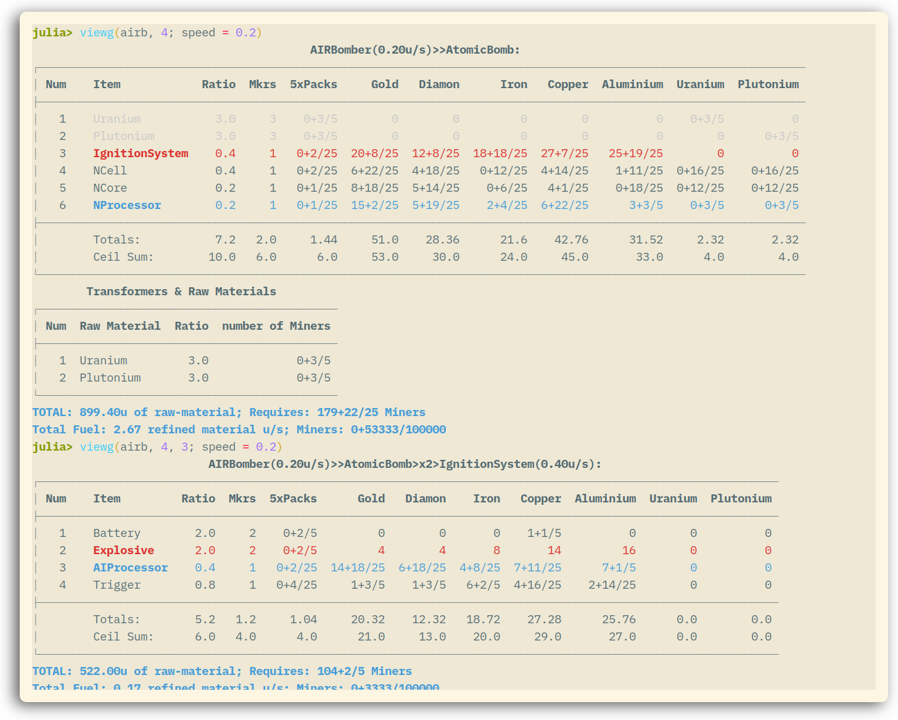

```@meta
CurrentModule = AssemblyLine2PC
```

# AssemblyLine2PC

Welcome to the documentation portal for `AssemblyLine2PC.jl`, the Julia toolkit for
analyzing Assembly Line 2 production graphs.
The package ships the full recipe data set together with helpers for computing material requirements, sizing mining fleets, and rendering readable build reports.

Use the navigation sidebar to explore:

- **Architecture** – how the data graph is constructed and how to extend it.
- **Performance tuning** – tips for squeezing the most out of the traversal and
  reporting utilities.
- **API reference** – detailed signatures and docstrings for public entry points.

## Quick start

### Install

```julia
import Pkg
Pkg.develop("https://github.com/LauraBMo/MinerNumbers.jl.git") # Dependency
Pkg.develop("https://github.com/LauraBMo/AssemblyLine2PC.jl.git")
```

### Naviagate recipe 
For example, for AI Robot Bomber ("AIRBomber" in [`Data.jl`](https://github.com/LauraBMo/AssemblyLine2PC.jl/blob/main/src/Data.jl)) at max theoretical speed for your given limit of starters:

```julia
using AssemblyLine2PC

VG = viewgraph();

airb = "AIRBomber"
max_miners = 310 + 46*2  # Your starters limit for the job. 

# PrettyTables report showing intermediate makers, pack ratios, and raw demand…
VG(airb; miners = max_miners)
# Look up subfactories
VG(airb, 4, 6; miners = max_miners)
```

Ready to dive deeper? Start with the [architecture tour](@ref architecture-tour) to
understand how the graph is built.

See screenshots on how to navigate to graph.

- First, recipe for AI Robot Bober and second, recipe for the 4th element in AI Robot Bomber; that is Atomic Bomb. 



- Again, recipe for Atomic Bomb needed to produce 0.2u/s of AI Robot Bomber. Second, subrecipe (4, 3) for Ignition System (which we need at 0.4u/s, see the title).


